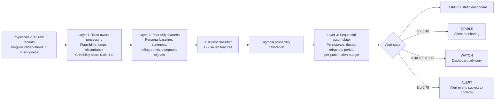

# SilentWindow

> **A retrospective ICU early-warning research prototype that prioritizes reliable, persistent evidence over noisy instantaneous alarms.**

[](#scope-and-safety)
[](#architecture)
[](#architecture)
[](#data-and-evaluation)

SilentWindow is a research demonstrator for reducing alarm fatigue in ICU telemetry. It evaluates a three-layer pipeline that **assesses signal credibility, builds patient-specific temporal features, and accumulates evidence before changing alert state**.

The repository contains a FastAPI service, a static dashboard, the offline ML/evaluation pipeline, trained artifacts, and saved retrospective evaluation results.

## Scope and safety

> **Research prototype only. Retrospective data only. Not a medical device.**
>
> SilentWindow does not provide a diagnosis, treatment recommendation, or validated clinical decision. It has not been prospectively evaluated and must not be connected to patient care or used for real-world medical decision-making.
>
> The dataset exposes in-hospital outcomes and stay metadata, but not an exact timestamp for physiological collapse or death. Any “lead time” reported by this repository is therefore an **estimated proxy relative to the available outcome/stay endpoint**, not validated time-to-deterioration.

The saved accuracy report also notes that the current service has **no live telemetry-ingestion route** and that the held-out results are not evidence of real-time clinical performance.

## Why SilentWindow?

A single abnormal reading can be caused by motion, a loose sensor, missingness, or an implausible jump. A direct threshold or instantaneous model can therefore produce alerts that are frequent but difficult to act on.

SilentWindow separates three questions:

1. **Can this observation be trusted?**
2. **How different is this patient from their own recent baseline?**
3. **Has elevated risk persisted long enough to justify changing state?**

The result is an interpretable **STABLE → WATCH → ALERT** state machine rather than an alert on every isolated risk spike.

## Architecture



### Layer 1 — Trust-aware signal processing

Implemented in [`ml/trust_layer.py`](ml/trust_layer.py). The processor does not delete observations. It returns an assessment containing the original value, validity, credibility score, and an optional reason for downweighting.

Checks include:

- Configured plausibility ranges for vitals and labs.
- Rate-of-change checks against recent history.
- Systolic/diastolic blood-pressure discordance.
- Per-observation credibility bounded to `0.05–1.0`.
- Missingness and time-since-last-measurement are preserved downstream.

### Layer 2 — Personal baseline and trajectory features

Implemented in [`ml/features.py`](ml/features.py). At evaluation time `T`, features are built only from observations where `time_hours <= T`.

The default configuration uses:

- A first **6-hour** personal baseline window.
- A **1-hour** evaluation grid for replay.
- Rolling history and changes over **1, 3, and 6 hours**.
- Missingness flags and staleness clocks.
- Baseline deviations, slopes, recent variability, shock index, and a compound HR/BP/respiratory deterioration signal.

### Model and calibration

Implemented in [`ml/train.py`](ml/train.py) and [`ml/calibration.py`](ml/calibration.py).

- **Classifier:** XGBoost tabular classifier.
- **Saved feature schema:** 127 features in [`models/feature_names.json`](models/feature_names.json).
- **Calibration:** sigmoid/Platt-style calibration using the validation split.
- **Artifacts:** [`models/xgboost_model.joblib`](models/xgboost_model.joblib), [`models/calibrator.joblib`](models/calibrator.joblib), and [`models/metrics.json`](models/metrics.json).

### Layer 3 — Sequential evidence accumulation

Implemented in [`ml/evidence_accumulator.py`](ml/evidence_accumulator.py). The accumulator is CUSUM-inspired rather than a direct clinical score.

Default thresholds from [`configs/config.yaml`](configs/config.yaml):

| State | Evidence score | Behavior |
|---|---:|---|
| `STABLE` | `< 0.40` | Silent monitoring |
| `WATCH` | `0.40–<0.75` | Dashboard advisory; no alert event emitted by the accumulator |
| `ALERT` | `≥ 0.75` | High-evidence state, subject to suppression controls |

The implementation also applies **0.88 risk decay**, a **6-hour refractory period**, and a maximum of **3 alert events per patient**.

## Data and evaluation

The pipeline targets **PhysioNet / Computing in Cardiology Challenge 2012, Set A**. The repository stores inspection and evaluation artifacts, but **does not include the raw dataset**.

The checked-in data summary reports:

- **3,200** patient files / outcomes in the inspected dataset.
- **443** in-hospital deaths and a **13.84%** overall positive rate.
- Up to **48 hours** of telemetry per replayed patient.

The saved held-out replay artifact reports:

- **152** test patients: 22 positive and 130 negative outcomes.
- **7,095** total monitoring hours.
- 60 SilentWindow alert events, of which 51 are counted as false-alert events under the repository’s evaluation definition.

### Saved held-out comparison

These are the values in [`results/evaluation_summary.json`](results/evaluation_summary.json). They are **offline retrospective benchmark results**, not clinical validation.

| Policy | Sensitivity / recall | Precision | False-alert events | Alerts / patient-day | Median proxy lead time |
|---|---:|---:|---:|---:|---:|
| **Full SilentWindow** | 13.6% (3/22) | 15.0% | 51 | 0.203 | 37.0 h |
| Plain ML threshold | 4.5% (1/22) | 33.3% | 24 | 0.203 | 41.0 h |
| Simplified threshold | **40.9% (9/22)** | 22.0% | 120 | 0.504 | 41.0 h |

The result demonstrates a trade-off on this small saved cohort: SilentWindow emits fewer alert events than the simple threshold baseline, but it also detects fewer positive patients. It should not be described as superior on sensitivity or as clinically validated.

### Model-training validation metrics

The separately saved training metrics in [`models/metrics.json`](models/metrics.json) are **validation-split metrics**, not the held-out chronological replay metrics:

| Metric | Value |
|---|---:|
| ROC-AUC | 0.6990 |
| PR-AUC | 0.2803 |
| Brier score, raw | 0.1275 |
| Brier score, calibrated | 0.1080 |
| Log loss | 0.3638 |

The saved replay artifact reports lower held-out discrimination: ROC-AUC **0.6407** and PR-AUC **0.2443**.

### Ablation study

Saved in [`results/ablation_results.json`](results/ablation_results.json). The study is descriptive and cohort-specific; it does not prove that every component improves performance.

| Configuration | Sensitivity | Precision | False-alert events | Alerts / patient-day |
|---|---:|---:|---:|---:|
| Full SilentWindow | 13.6% | 15.0% | 51 | 0.203 |
| Without Trust Layer | 13.6% | 15.0% | 51 | 0.203 |
| Without Personal Baseline | 13.6% | 75.0% | 11 | 0.154 |
| Without Evidence Accumulator | 4.5% | 33.3% | 24 | 0.203 |

Notably, the saved `Without Trust Layer` row is identical to the full-system row, and the `Without Personal Baseline` row has fewer false-alert events in this cohort. Those findings require further investigation rather than celebratory interpretation.

### Synthetic noise stress test

The saved experiment in [`results/noise_stress_results.json`](results/noise_stress_results.json) injects 50% missingness/spike/jitter intensity into 30 patients. It is a small synthetic robustness experiment, not real-time validation:

| System | Clean false alerts | Noisy false alerts | Change in this run |
|---|---:|---:|---:|
| SilentWindow | 3 | 3 | 0.0% |
| Plain ML | 0 | 2 | +200.0% |
| Simplified threshold | 7 | 16 | +128.6% |

## Dashboard

The default launcher serves [`frontend/index.html`](frontend/index.html) and [`frontend/app.js`](frontend/app.js). The dashboard is a retrospective analytics console with:

- Overview metrics and the saved cohort comparison.
- Ward monitor with patient state, risk, evidence, trend, credibility, and alert counts.
- Patient timeline replay with scrubber, play/pause/reset, and 1×/2×/5× speed controls.
- Synchronized vital, calibrated-risk, and evidence charts.
- Performance and ablation views backed by saved JSON artifacts.
- An alert-policy sweep for comparing sensitivity, precision, false-alert events, and alerts per patient-day across operating points.
- A noise lab that runs the in-memory stress-test endpoint.
- An optional legacy Gemini CSV/chat view and optional Telegram alert action in the default frontend/backend route.

The timeline UI filters points to the selected replay time before rendering them. This is a visualization of the retrospective replay; it is not a live telemetry stream.

The repository now also includes a **live-style incremental simulation API**. It accepts one chronological batch at a time, updates in-memory patient state, and returns trust-adjusted data quality, calibrated risk, evidence score, alert state, suppression status, and model metadata. It is intended for demos and shadow-mode experiments; it is not a durable multi-worker clinical stream processor.

## Demo video

Watch the **84-second SilentWindow Yuva Megathon demo**:

[](demos/SilentWindow_Yuva_Megathon_Demo.mp4)

The MP4 is included at [`demos/SilentWindow_Yuva_Megathon_Demo.mp4`](demos/SilentWindow_Yuva_Megathon_Demo.mp4) so the walkthrough remains versioned alongside the project.

## API surface

The default FastAPI application is [`backend.main:app`](backend/main.py), with routes defined in [`backend/api/router.py`](backend/api/router.py). Interactive OpenAPI documentation is available at `/docs` when the service is running.

| Method | Route | Purpose |
|---|---|---|
| `GET` | `/health` | Liveness check and runtime mode |
| `GET` | `/version` | Application, config, and artifact metadata |
| `GET` | `/api/overview` | Saved cohort metrics and current retrospective state counts |
| `GET` | `/api/ward` | Latest saved state for each test patient |
| `GET` | `/api/patient/{patient_id}/timeline` | Chronological replay records for one patient |
| `GET` | `/api/patient/{patient_id}/explanation` | SHAP/trust explanation generated from the saved pipeline |
| `GET` | `/api/performance` | Saved evaluation summary and curves |
| `GET` | `/api/policy-sweep?thresholds=0.55,0.65,0.75` | Operating-point sweep over saved chronological replay |
| `GET` | `/api/ablation` | Saved ablation table |
| `GET` | `/api/noise-lab` | Cached or default noise-stress results |
| `POST` | `/api/noise-lab/run` | Run an in-memory noise experiment with request parameters |
| `POST` | `/api/v1/patients/{patient_id}/observations` | Score one chronological observation batch |
| `GET` | `/api/v1/patients/{patient_id}/state` | Inspect in-memory streaming state |
| `DELETE` | `/api/v1/patients/{patient_id}/state` | Reset one local demo patient state |
| `POST` | `/api/chat` | Legacy Gemini chat/CSV analysis route; requires `GEMINI_API_KEY` |
| `POST` | `/api/telegram_alert?patient_id=...` | Optional Telegram notification; requires bot credentials |

Example incremental request:

```bash
curl -X POST http://127.0.0.1:8000/api/v1/patients/138123/observations \
  -H 'Content-Type: application/json' \
  -d '{"timestamp_hours": 4, "observations": {"HR": 82, "SysABP": 118, "RespRate": 19}, "static_info": {"Age": 65, "ICUType": 2}}'
```

### Experimental / not wired into the default app

The repository also contains [`ai.py`](ai.py), an alternate `/api/ai/ask` implementation with Gemini generation and best-effort Supabase persistence. The checked-in default launcher imports `backend.main`, which does **not** mount this router. The root [`main.py`](main.py) references a missing `backend.api.ai` module, so it is not a supported entry point in the current checkout.

## Quickstart

### Prerequisites

- Python **3.10–3.12** is the range declared by the repository’s dependency lock.
- The raw PhysioNet files, obtained and used according to their dataset terms.
- A browser for the dashboard.

### 1. Install dependencies

```bash
python -m venv .venv
source .venv/bin/activate       # Windows: .venv\\Scripts\\activate
python -m pip install --upgrade pip
python -m pip install -r requirements.txt
```

The dependency file is now valid and includes the server, multipart upload, test, runtime, and Gemini SDK packages. The deployed Render service has Gemini enabled through Render environment variables; secrets are not committed to Git.

### 2. Add the raw dataset

The raw data is intentionally ignored by Git. Place it at the paths expected by [`configs/config.yaml`](configs/config.yaml):

```text
data/raw/Outcomes-train.txt
data/raw/set-a/<RecordID>.txt
```

The default configuration uses a stratified sample of up to 1,000 patients for pipeline generation. Set `data.max_patients: null` if you intentionally want to process all available admissions.

### 3. Reproduce the offline pipeline

```bash
python run.py --reproduce
```

This runs the test suite, trains the model/calibrator, evaluates the chronological test replay, runs the ablation study, and runs the synthetic noise test. It writes generated data under ignored `data/` paths and refreshes model/results artifacts.

### 4. Launch the dashboard

```bash
python run.py
# or
python run.py --server --host 127.0.0.1 --port 8000
```

Open:

- Dashboard: <http://127.0.0.1:8000>
- API docs: <http://127.0.0.1:8000/docs>

If required model/evaluation artifacts are missing, the launcher exits with an actionable message instead of mutating artifacts at boot. Run `python run.py --reproduce` first. The service exposes `GET /health` and `GET /version` for smoke checks.

### Container launch

The checked-in model and result artifacts are sufficient for the demo container:

```bash
docker build -t silentwindow .
docker run --rm -p 8000:8000 silentwindow
```

The raw challenge dataset is intentionally excluded from the image. Use the local Python pipeline with the dataset mounted separately when retraining.

### Pipeline commands

```bash
python run.py --test        # pytest tests/test_silentwindow.py
python run.py --train       # train XGBoost and fit calibration
python run.py --evaluate    # chronological held-out replay
python run.py --ablation    # component ablation study
python run.py --noise-test  # synthetic noise stress test
python run.py --all         # all pipeline stages, then server
```

## Configuration

The main configuration file is [`configs/config.yaml`](configs/config.yaml). It controls:

- Dataset paths and train/validation/test proportions (`70%/15%/15%`).
- Random seed (`42`) and optional patient cap.
- Baseline and rolling windows.
- Trust ranges, jump thresholds, and penalties.
- XGBoost hyperparameters and calibration method.
- Watch/alert thresholds, decay, refractory period, and alert budget.
- Synthetic noise settings.

Environment variables are documented in [`.env.example`](.env.example):

| Variable | Used by | Required |
|---|---|---|
| `GEMINI_API_KEY` | Legacy `/api/chat` route and alternate AI module | Only for AI features |
| `GEMINI_MODEL` | Gemini model selection | Optional; defaults differ by route |
| `SUPABASE_URL` | Alternate `ai.py` persistence path | Only for experimental persistence |
| `SUPABASE_PUBLISHABLE_KEY` / `SUPABASE_ANON_KEY` | Alternate `ai.py` persistence path | Only for experimental persistence |
| `TELEGRAM_BOT_TOKEN` | Telegram alert route | Only for Telegram notifications |
| `TELEGRAM_CHAT_ID` | Telegram alert destination | Only for Telegram notifications |

Never commit real secrets. The optional Supabase table definition is in [`schema.sql`](schema.sql) and enables row-level security for `ai_chat_messages`; it is not required for the default dashboard.

## Security and operational posture

The code implements some defensive behavior, but it is **not production-hardened**:

- **Input validation:** Pydantic validates noise-test and alternate AI request payloads; the legacy chat route accepts multipart text/file input.
- **Streaming validation:** Incremental requests validate patient IDs, finite numeric values, non-empty observation batches, and the configured 48-hour horizon; out-of-order batches are rejected.
- **Secrets:** Environment variables are used for optional external services; `.env` is ignored by Git.
- **Database security:** `schema.sql` enables Supabase RLS and creates an anonymous insert policy for chat messages. This applies only if that optional schema is deployed.
- **Authentication/authorization:** **Not implemented** for the default API.
- **CORS:** The FastAPI app defaults to localhost origins and can be configured with `CORS_ORIGINS`.
- **Rate limiting:** **Not implemented.**
- **Live ingestion/state:** Incremental simulation is implemented, but state is process-local and is lost on restart; it is not safe for multi-worker deployment.
- **Encryption/audit controls:** No application-level encryption, user identity model, or production audit trail is implemented.

Do not expose the default service directly to a public network without adding authentication, restrictive CORS, request limits, durable state, secret management, structured logging, and an appropriately reviewed deployment boundary.

## Repository map

```text
.
├── backend/
│   ├── main.py                 # Supported FastAPI app entry point
│   └── api/router.py            # Default REST routes and legacy integrations
├── frontend/
│   ├── index.html              # Dashboard served by backend.main
│   └── app.js                  # Dashboard client and charts
├── ml/
│   ├── preprocessing.py        # Raw-record parsing and patient splits
│   ├── trust_layer.py          # Credibility assessment
│   ├── features.py             # Past-only feature engineering
│   ├── train.py                # XGBoost training and calibration
│   ├── replay.py               # Chronological replay engine
│   ├── evidence_accumulator.py # Sequential state/alert logic
│   ├── evaluation.py           # Offline metrics and curves
│   ├── ablation.py              # Component ablation
│   ├── noise_test.py            # Synthetic corruption experiments
│   ├── policy_sweep.py          # Alert operating-point analysis
│   └── explainability.py        # SHAP and trust provenance
├── models/                     # Checked-in model/calibrator artifacts
├── results/                    # Checked-in saved evaluation artifacts
├── configs/config.yaml         # Pipeline and alert configuration
├── tests/                      # Core and API contract tests
├── run.py                      # CLI and server launcher
├── Makefile                    # Install, test, check, run, reproduce commands
├── .github/workflows/ci.yml    # Python 3.10–3.12 CI
├── Dockerfile                  # Reproducible demo container
├── schema.sql                  # Optional Supabase chat table/RLS
└── api/index.py                # Vercel adapter targeting backend.main
```

There are also top-level legacy/alternate modules such as `main.py`, `app.js`, `index.html`, `ai.py`, and compatibility scripts. They are not the supported default path unless explicitly wired into a deployment.

## Verification status and known limitations

- Python syntax compilation succeeds with `python -m compileall`.
- The test suite is runnable after dependency installation; only the raw-data split test is skipped when the ignored dataset is absent.
- The current checkout does not contain `data/raw`, so training and full reproduction cannot start until the dataset is supplied.
- The saved evaluation is retrospective, small, and outcome-proxy based.
- The new streaming endpoint is a local in-memory simulation; no durable patient-state service, timestamped live ground truth, prospective shadow mode, or clinical validation is included.
- The model-improvement benchmark in [`model_improvement_report.md`](model_improvement_report.md) is explicitly marked offline and is **not** copied into the saved production model artifacts.

## Research follow-ups

The following are not implemented features; they are the work required before any operational evaluation:

- Restore and version the input-data contract without committing restricted raw data.
- Add authentication, units, and a durable event store around the versioned telemetry-simulation API.
- Persist patient state between events and log model/version/feature timestamps for every prediction.
- Define a timestamped evaluation target and validate on a locked temporal cohort.
- Run prospective shadow-mode evaluation with calibration, alert burden, subgroup, latency, and safety review.
- Replace permissive local-development CORS and add authentication, rate limiting, monitoring, and deployment tests.

## License and dataset terms

The SilentWindow source code in this repository is available under your choice of the following alternative licenses:

- [MIT License](LICENSE)
- [Apache License 2.0](LICENSE-APACHE)
- [GNU General Public License v3.0](LICENSE-GPL-3.0)

These are **alternative options**, not cumulative obligations: users may choose the license that best fits their intended use. The complete, unmodified license texts are included in the repository.

The selected project license applies to the project code and documentation only. Third-party dependencies retain their own licenses. The PhysioNet / Computing in Cardiology Challenge 2012 data is not included here and is **not** relicensed by this repository. Obtain it from its authoritative source and comply with the dataset’s own access, citation, and usage terms.
